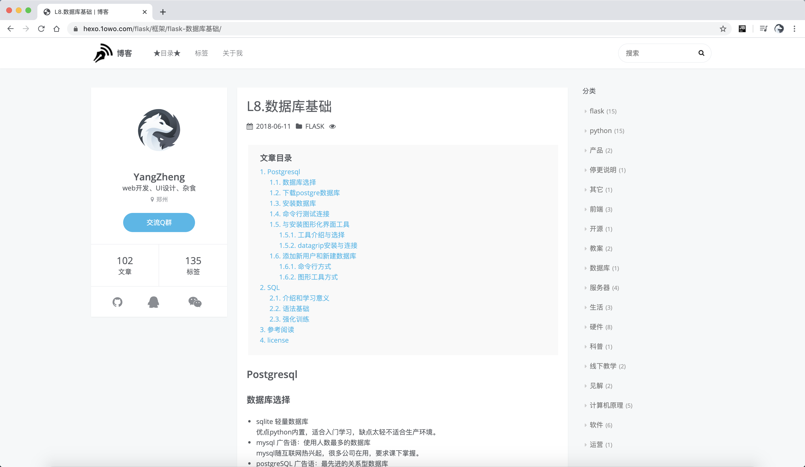

Blog based on Hexo
===
## Brief
Status: Obsoleted  废弃  
Year: 2018  
Language: Chinese  

Disadvantages of static blog came out along with blog increases, and I want to write something systemic, 
so I stopped updating after wrote approximated 100 original articles.  

2018年时写了大约一百篇的图文文章，为了直观使用了许多截图，写一篇文章的时间超过录制一节课视频。但在文章量增长后，静态博客变得越来越难以维护; 
而且我想写些更系统的文章，类似书而不是博客，因此停止更新。  
整理时经过一系列操作.git文件夹迷之消失了，commit记录没了，虽然不是重要的事。  
## Tech
Hexo: there are many static generate blog framework though, frontend ecology come out more beautiful than backend's.  
Icarus: a beautiful designed Hexo theme.

## Screen shot

